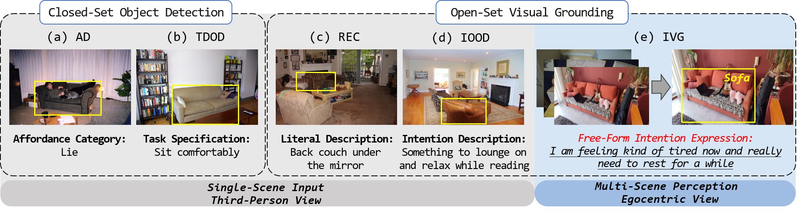
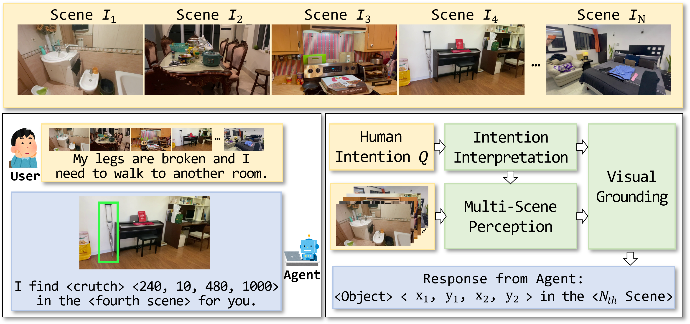
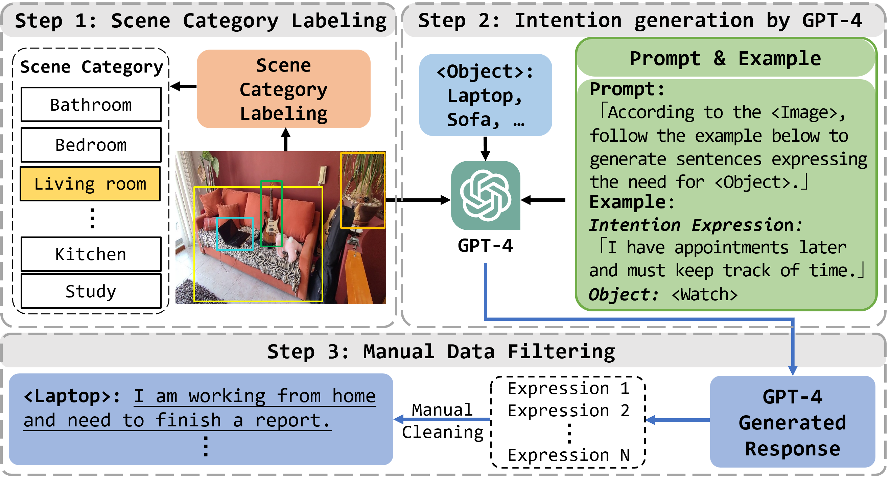
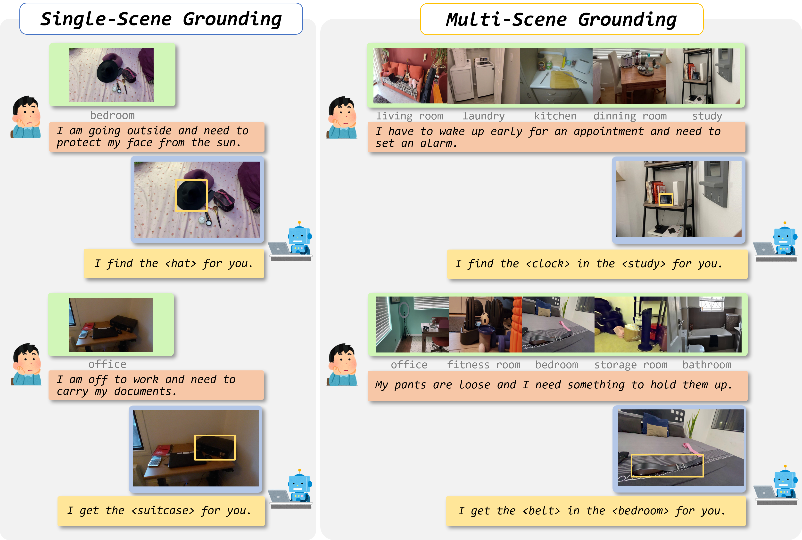
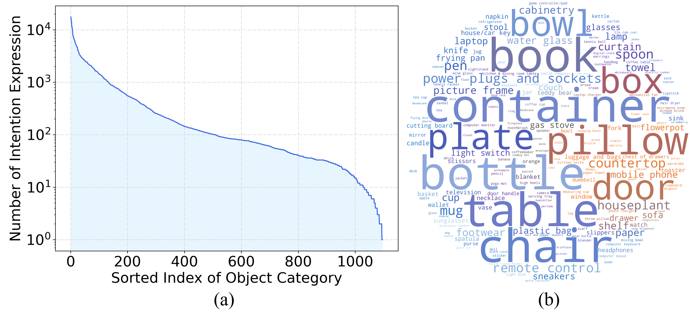
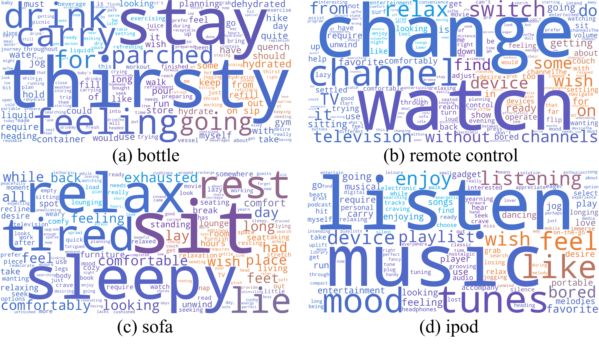
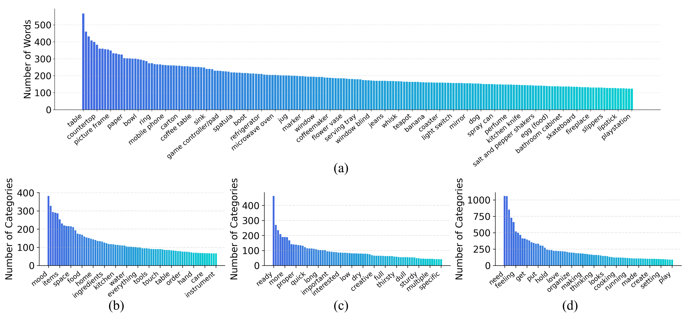
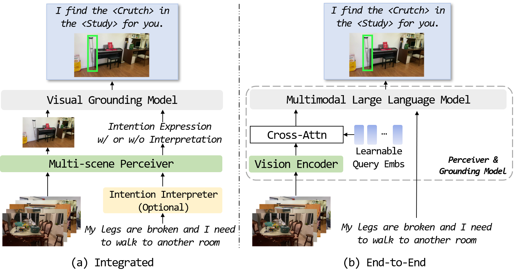
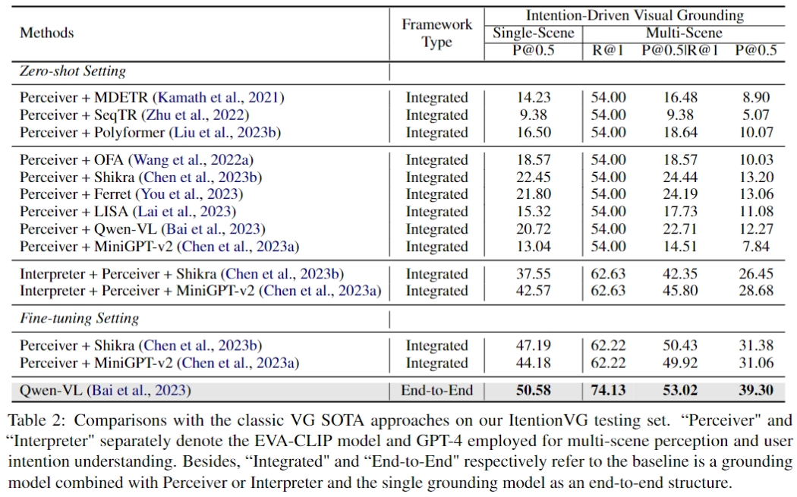

# Beyond Literal Descriptions: Understanding and Locating Open-World Objects Aligned with Human Intentions
Wenxuan Wang, Yisi Zhang, Xingjian He, Yichen Yan, Zijia Zhao, Xinlong Wang, Jing Liu

<p align="center">
 <a href='https://jingw193.github.io/AdaptiveFSS/'></a> <a href='https://arxiv.org/pdf/2312.15731.pdf'></a>
</p>

## 🚩 **Updates**
Welcome to this repository for the latest updates.

✅ **[2024.4.25]** : Released project page and our paper on arXiv.

✅ **[-]** : Released our data and baselines.

## 🌕 Abstract
Visual grounding (VG) aims at locating the foreground entities that match the given natural language expression. Previous datasets and methods for classic VG task mainly rely on the prior assumption that the given expression must literally refer to the target object, which greatly impedes the practical deployment of agents in real-world scenarios. Since users usually prefer to provide the intention-based expressions for the desired object instead of covering all the details, it is necessary for the agents to interpret the intention-driven instructions. Thus, in this work, we take a step further to the intention-driven visual-language (V-L) understanding. To promote classic VG towards human intention interpretation, we propose a new intention-driven visual grounding (IVG) task and build a largest-scale IVG dataset named IntentionVG with free-form intention expressions. Considering that practical agents need to move and find specific targets among various scenarios to realize the grounding task, our IVG task and IntentionVG dataset have taken the crucial properties of both multi-scenario perception and egocentric view into consideration. Besides, various types of models are set up as the baselines to realize our IVG task. Extensive experiments on our IntentionVG dataset and baselines demonstrate the necessity and efficacy of our method for the V-L field. To foster future research in this direction, our newly built dataset and baselines will be publicly available.
<p align="center">
 
</p>

---
## 🌖 Intention-Driven Visual Grounding (IVG) Task
<p align="center">
 
</p>

## 🌗 Data Generation Engine & IntentionVG Dataset
<p align="center">
 
</p>
<p align="center">
 
</p>
<p align="center">
 
</p>
<p align="center">
 
</p>
<p align="center">
 
</p>

## 🌘 Baseline Constructions
<p align="center">
 
</p>

## 🌑 Results
<p align="center">
 
</p>

## 🚀 Citation
If you use our data or model in your work or find it is helpful, please cite the corresponding paper:

```
@article{wang2023unveiling,
  title={Unveiling Parts Beyond Objects: Towards Finer-Granularity Referring Expression Segmentation},
  author={Wang, Wenxuan and Yue, Tongtian and Zhang, Yisi and Guo, Longteng and He, Xingjian and Wang, Xinlong and Liu, Jing},
  journal={arXiv preprint arXiv:2312.08007},
  year={2023}
}
```

## 🏭 Acknowledgement
This work is built on many excellent research works and open-source projects, thanks a lot to all the authors for sharing!

1.[EVA-CLIP](https://github.com/baaivision/EVA/tree/master/EVA-CLIP)

2.[Qwen-VL](https://github.com/QwenLM/Qwen-VL)

3.[MiniGPT-4](https://github.com/Vision-CAIR/MiniGPT-4)

